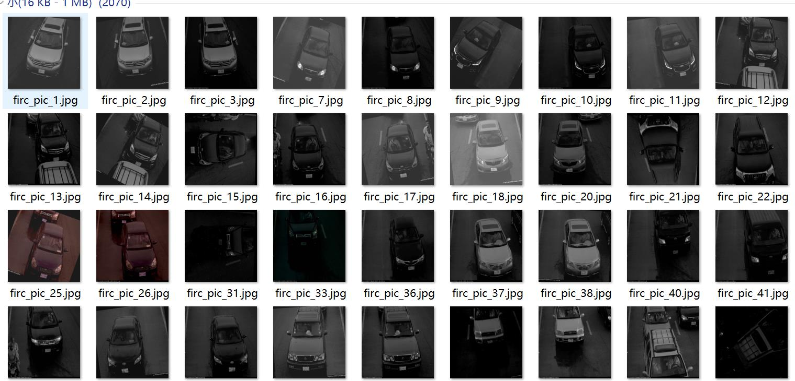
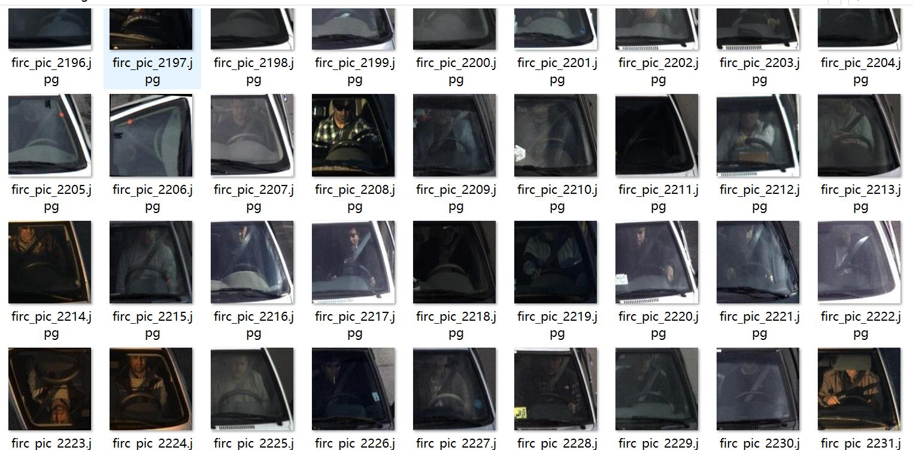
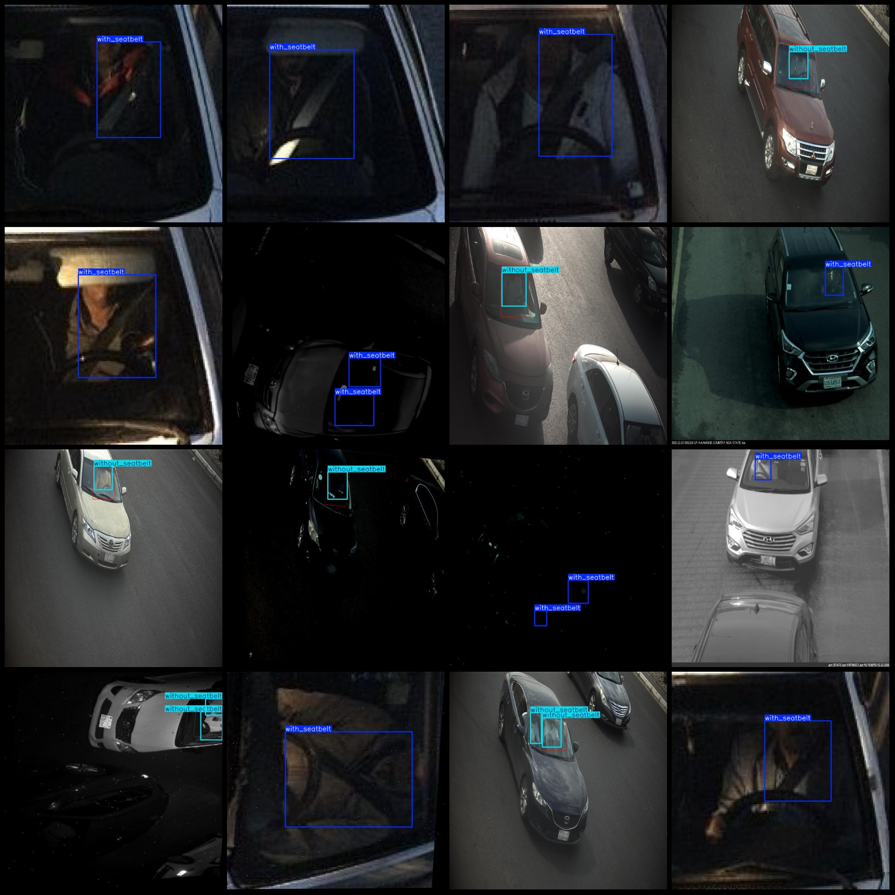
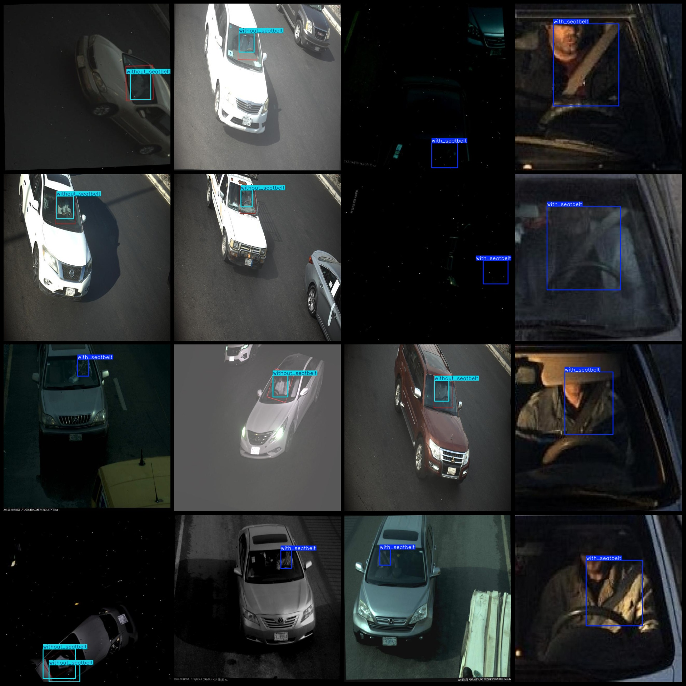

# Smart Traffic Roadside Monitoring Viewpoint: Standards for Unbelted Drivers and Seat Belts

Dataset format: Pascal VOC format + YOLO format (without the split path in the txt file, only containing jpg images along with their corresponding VOC format xml files and YOLO format txt files).
Number of images (jpg file count): 2357
Number of annotations (xml file count): 2357
Number of annotations (txt file count): 2357
Number of categories: 2
Categories in labels folder (note that the order in the YOLO format does not correspond to this, but is based on classes.txt): ["with_seatbelt", "without_seatbelt"]
Each category has a number of bounding boxes:
- with_seatbelt: 2057
- without_seatbelt: 810
Total bounding boxes: 2867
Number of images per category:
- with_seatbelt: 1809
- without_seatbelt: 667
Image resolution: 640x640
Annotation tool used: labelImg
Annotation rules: Draw a rectangle around the category.
Important note: The dataset does not include a training/validation/test split; users are required to do so themselves.
Special declaration: This dataset does not guarantee any accuracy in models or weight files trained on it.
Image preview:
Annotation examples:

## Images

Here is a pay link on Stripe ( https://buy.stripe.com/3cs8yP7sY87d0vu9AB ). Please contact me lonlonago@foxmail.com after funding $89, and I will send you a complete data files , thank you!

